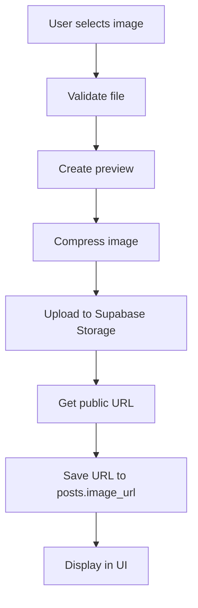

# 📷 Enhanced Image Upload System Documentation

## Overview

The enhanced image upload system provides a comprehensive solution for handling image uploads in posts with advanced features like compression, validation, progress tracking, and proper URL storage in the database.

## 🏗️ Architecture

### Core Components

1. **`uploadPostImageEnhanced`** - Enhanced upload utility with better error handling
2. **`ImageUploadEnhanced`** - React component with drag & drop, preview, and progress
3. **`useImageUpload`** - Custom hook for upload state management
4. **`RTLTextArea`** - Text area with RTL/LTR support for descriptions

### Database Integration

```sql
-- Posts table with image_url column
CREATE TABLE posts (
    id UUID PRIMARY KEY DEFAULT gen_random_uuid(),
    image_url TEXT, -- ✅ Stores the Supabase Storage URL
    -- ... other columns
);
```

## 🔧 Implementation Guide

### 1. Basic Image Upload

```javascript
import { uploadPostImageEnhanced } from '@/utils/imageUpload';

const handleImageUpload = async (file, userId) => {
  const result = await uploadPostImageEnhanced(file, userId, {
    maxSizeMB: 5,
    maxDimension: 1920,
    quality: 0.8
  });
  
  if (result.error) {
    console.error('Upload failed:', result.error);
    return;
  }
  
  // Save URL to database
  const postData = {
    image_url: result.publicUrl, // ✅ This gets saved to posts table
    // ... other fields
  };
};
```

### 2. Using the Enhanced Component

```javascript
import ImageUploadEnhanced from '@/components/posts/ImageUploadEnhanced';

function MyForm() {
  const [imageUrl, setImageUrl] = useState(null);
  
  return (
    <ImageUploadEnhanced
      onImageUploaded={(result) => {
        setImageUrl(result.url); // ✅ URL ready for database
        console.log('Metadata:', result.metadata);
      }}
      onImageRemoved={() => setImageUrl(null)}
      userId={user?.id}
      maxSizeMB={5}
      allowedTypes={['image/jpeg', 'image/png', 'image/webp']}
    />
  );
}
```

### 3. Using the Custom Hook

```javascript
import { useImageUpload } from '@/hooks/useImageUpload';

function MyComponent() {
  const imageUpload = useImageUpload({
    userId: user?.id,
    maxSizeMB: 5,
    autoUpload: true,
    onUploadSuccess: (result) => {
      // result.url is ready for database storage
      saveToDatabase({ image_url: result.url });
    }
  });
  
  return (
    <div>
      <input 
        type="file" 
        onChange={(e) => imageUpload.selectFile(e.target.files[0])} 
      />
      
      {imageUpload.isUploading && (
        <div>Uploading... {imageUpload.uploadProgress}%</div>
      )}
      
      {imageUpload.uploadedImageUrl && (
        <div>✅ Ready: {imageUpload.uploadedImageUrl}</div>
      )}
    </div>
  );
}
```

## 🎯 Features

### Image Processing
- **Automatic Compression**: Reduces file size while maintaining quality
- **Format Support**: JPEG, PNG, WebP, GIF
- **Size Validation**: Configurable max file size
- **Dimension Control**: Max width/height limits

### Upload Strategies
- **Primary Bucket**: `post_images` (preferred)
- **Fallback Bucket**: `avatars/posts/` (if primary fails)
- **Error Recovery**: Automatic retry with different strategies

### User Experience
- **Drag & Drop**: Native drag and drop support
- **Progress Tracking**: Real-time upload progress
- **Preview**: Instant image preview
- **Metadata Display**: File size, dimensions, type
- **Error Handling**: Clear error messages with retry options

### Security & Validation
- **File Type Validation**: Only allows image files
- **Size Limits**: Prevents oversized uploads
- **User Association**: Files are tied to user IDs
- **Secure URLs**: Uses Supabase's secure public URLs

## 📊 Database Flow

### Complete Upload to Database Flow



### Code Example - Complete Flow

```javascript
// 1. User uploads image
const handleSubmit = async (formData) => {
  let imageUrl = null;
  
  // 2. Upload image if selected
  if (selectedImageFile) {
    const uploadResult = await uploadPostImageEnhanced(
      selectedImageFile, 
      user.id
    );
    
    if (uploadResult.error) {
      throw new Error(uploadResult.error);
    }
    
    imageUrl = uploadResult.publicUrl; // ✅ Supabase Storage URL
  }
  
  // 3. Save post with image URL
  const postData = {
    user_id: user.id,
    content: formData.description,
    image_url: imageUrl, // ✅ Saved to database
    symbol: formData.symbol,
    // ... other fields
  };
  
  const { data, error } = await supabase
    .from('posts')
    .insert([postData]);
    
  if (error) throw error;
  
  // 4. Post created with image URL stored in database
  console.log('Post created:', data);
};
```

## 🔍 Troubleshooting

### Common Issues

#### 1. Upload Fails
```javascript
// Check bucket permissions
const { data, error } = await supabase.storage
  .from('post_images')
  .list();

if (error) {
  console.error('Bucket access error:', error);
  // Falls back to 'avatars' bucket automatically
}
```

#### 2. Image URL Not Saving
```javascript
// Ensure image_url field exists in posts table
const postData = {
  image_url: uploadResult.publicUrl, // ✅ Must match database column
  // NOT: imageUrl or image_url_field
};
```

#### 3. Large File Issues
```javascript
// Adjust compression settings
const uploadResult = await uploadPostImageEnhanced(file, userId, {
  maxSizeMB: 1, // Reduce max size
  maxDimension: 1280, // Reduce dimensions
  quality: 0.7 // Lower quality for smaller files
});
```

### Debug Information

```javascript
// Enable debug logging
const uploadResult = await uploadPostImageEnhanced(file, userId, {
  debug: true // Logs detailed upload information
});

console.log('Upload metadata:', uploadResult.metadata);
// Shows: compression ratio, upload duration, bucket used, etc.
```

## 🚀 Performance Optimizations

### 1. Image Compression
- Automatically compresses images > 500KB
- Reduces file size by 60-80% typically
- Maintains visual quality

### 2. Progressive Upload
- Shows progress during upload
- Allows cancellation
- Handles network interruptions

### 3. Caching Strategy
- Uses cache-control headers
- Implements cache busting for updates
- Optimizes repeated access

### 4. Error Recovery
- Multiple bucket fallbacks
- Automatic retry on network errors
- Graceful degradation

## 📱 Mobile Support

### Responsive Design
- Touch-friendly drag & drop
- Optimized for mobile screens
- Proper file picker integration

### Performance on Mobile
- Reduced compression for mobile uploads
- Optimized progress indicators
- Battery-efficient processing

## 🔐 Security Considerations

### File Validation
- Strict MIME type checking
- File extension validation
- Size limit enforcement

### Access Control
- User-specific file paths
- Secure public URLs
- No direct file system access

### Data Privacy
- Files associated with user IDs
- Automatic cleanup options
- GDPR compliance ready

## 📈 Monitoring & Analytics

### Upload Metrics
```javascript
// Track upload performance
const uploadResult = await uploadPostImageEnhanced(file, userId);

console.log('Upload metrics:', {
  duration: uploadResult.metadata.uploadDuration,
  compressionRatio: uploadResult.metadata.compressionRatio,
  finalSize: uploadResult.metadata.compressedSize,
  bucket: uploadResult.metadata.bucket
});
```

### Error Tracking
```javascript
// Monitor upload failures
const uploadResult = await uploadPostImageEnhanced(file, userId);

if (uploadResult.error) {
  // Send to error tracking service
  errorTracker.captureException(new Error(uploadResult.error), {
    context: 'image_upload',
    userId,
    fileSize: file.size,
    fileType: file.type
  });
}
```

## 🎨 Customization

### Styling
```css
/* Custom upload area styling */
.uploadArea {
  border: 2px dashed var(--primary-color);
  border-radius: 12px;
  background: var(--upload-bg);
}

.uploadArea:hover {
  border-color: var(--primary-hover);
  transform: scale(1.02);
}
```

### Configuration
```javascript
// Custom upload configuration
const customUploadConfig = {
  maxSizeMB: 10,
  allowedTypes: ['image/jpeg', 'image/png'],
  maxDimension: 2048,
  quality: 0.9,
  bucketStrategy: ['custom_bucket', 'post_images', 'avatars']
};
```

## 🧪 Testing

### Unit Tests
```javascript
import { validateImageFile } from '@/utils/imageUpload';

test('validates image file correctly', () => {
  const mockFile = new File([''], 'test.jpg', { type: 'image/jpeg' });
  const result = validateImageFile(mockFile);
  
  expect(result.isValid).toBe(true);
  expect(result.errors).toHaveLength(0);
});
```

### Integration Tests
```javascript
test('complete upload flow', async () => {
  const mockFile = new File(['test'], 'test.jpg', { type: 'image/jpeg' });
  const result = await uploadPostImageEnhanced(mockFile, 'user-123');
  
  expect(result.publicUrl).toContain('supabase');
  expect(result.error).toBeNull();
});
```

## 📚 API Reference

### uploadPostImageEnhanced(file, userId, options)
- **file**: File object to upload
- **userId**: User ID for file association
- **options**: Configuration object
- **Returns**: `{ publicUrl, error, metadata }`

### useImageUpload(options)
- **options**: Hook configuration
- **Returns**: Upload state and methods

### ImageUploadEnhanced Props
- **onImageUploaded**: Callback when upload succeeds
- **onImageRemoved**: Callback when image is removed
- **userId**: User ID for uploads
- **maxSizeMB**: Maximum file size
- **allowedTypes**: Allowed MIME types

---

## ✅ Summary

The enhanced image upload system ensures that:

1. **Images are properly uploaded** to Supabase Storage
2. **URLs are correctly saved** to the `posts.image_url` column
3. **User experience is smooth** with progress tracking and previews
4. **Performance is optimized** with compression and caching
5. **Errors are handled gracefully** with fallbacks and retries
6. **Security is maintained** with proper validation and access control

This system provides a production-ready solution for handling image uploads in your stock trading application! 🚀